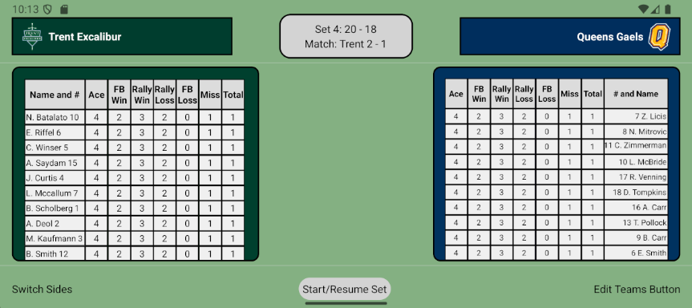
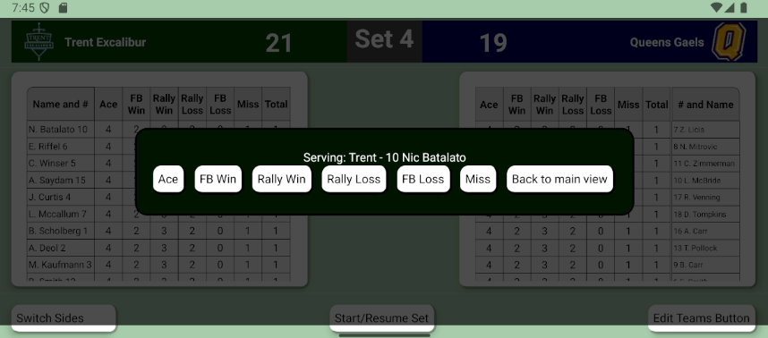

In development...  Volleyball Sideline Stat Tracker!!!👋
 
 
Release target...  September 1st, 2025
 
 
I am currently developing a volleyball sideline statistic tracking app using React, React Native, Bootstrap, .NET and MS SQL to be used by varsity teams and coaching staff.  I will be developing two interfaces; one developed for Android and iOS devices using React Native and the other being web based for desktop computers. Both interfaces will connect to a MS SQL server to keep data persistent from match to match.
 
 

 
 

<!--
**EvanRiffel/EvanRiffel** is a ✨ _special_ ✨ repository because its `README.md` (this file) appears on your GitHub profile.

Here are some ideas to get you started:

- 🔭 I’m currently working on ...
- 🌱 I’m currently learning ...
- 👯 I’m looking to collaborate on ...
- 🤔 I’m looking for help with ...
- 💬 Ask me about ...
- 📫 How to reach me: ...
- 😄 Pronouns: ...
- ⚡ Fun fact: ...
-->
