<table style="margin-left: -0.3pt; border-collapse: collapse; border: none; width: 648px;">
    <tbody>
        <tr>
            <td rowspan="2" style="width: 134.7pt; padding: 0cm 5.4pt; vertical-align: top; border: none;">
                

                    <strong></strong>
                

            </td>
            <td style="width: 350.95pt; padding: 0cm 5.4pt; vertical-align: top; border: none;">
                

                    <a href="https://play.google.com/store/apps/details?id=com.sportscan.volleyballStatTrackerAppOfficial&hl=en_CA">
                        <strong></strong>
                    </a>
                

            </td>
        </tr>
        <tr>
            <td style="width: 350.95pt; padding: 0cm 5.4pt; vertical-align: top; border: none;">
                

                    <a href="https://apps.apple.com/ca/app/volleyball-stat-tracker/id6751239025?platform=ipad">
                        <strong></strong>
                    </a>
                

            </td>
        </tr>
    </tbody>
</table>

<strong>&nbsp;</strong>

This app was developed solely by me for SportsCan as part of a paid 4 month co-op internship.

<strong>Technologies, Frameworks and Languages Used:&nbsp;</strong><em>React Native, JavaScript, TypeScript, CSS, Supabase, SQL, RevenueCat</em>

<strong>App Development Details:</strong>

    <ul style="margin-bottom:0cm;list-style-type: disc;">
        <li style='margin-top:0cm;margin-right:0cm;margin-bottom:8.0pt;margin-left:0cm;font-size:11.0pt;font-family:"Aptos",sans-serif;'>Hired to design and develop a volleyball sideline statistic tracking mobile app for Android and iOS devices for my and other varsity teams and coaching staff.&nbsp;</li>
        <li style='margin-top:0cm;margin-right:0cm;margin-bottom:8.0pt;margin-left:0cm;font-size:11.0pt;font-family:"Aptos",sans-serif;'>Worked with Trent Men&rsquo;s Volleyball coaching staff to identify requirements regarding data elements and report generation.</li>
        <li style='margin-top:0cm;margin-right:0cm;margin-bottom:8.0pt;margin-left:0cm;font-size:11.0pt;font-family:"Aptos",sans-serif;'>Data is stored locally and on an SQL server for data persistence and advanced analytics through desktop devices.</li>
    </ul>

<strong>&nbsp;</strong>

<table style="width: 100%; border-collapse: collapse; border: none;">
    <tbody>
        <tr>
            <td style="width: 50%; padding: 0cm 5.4pt; vertical-align: top; border: none;">
                

                    <strong>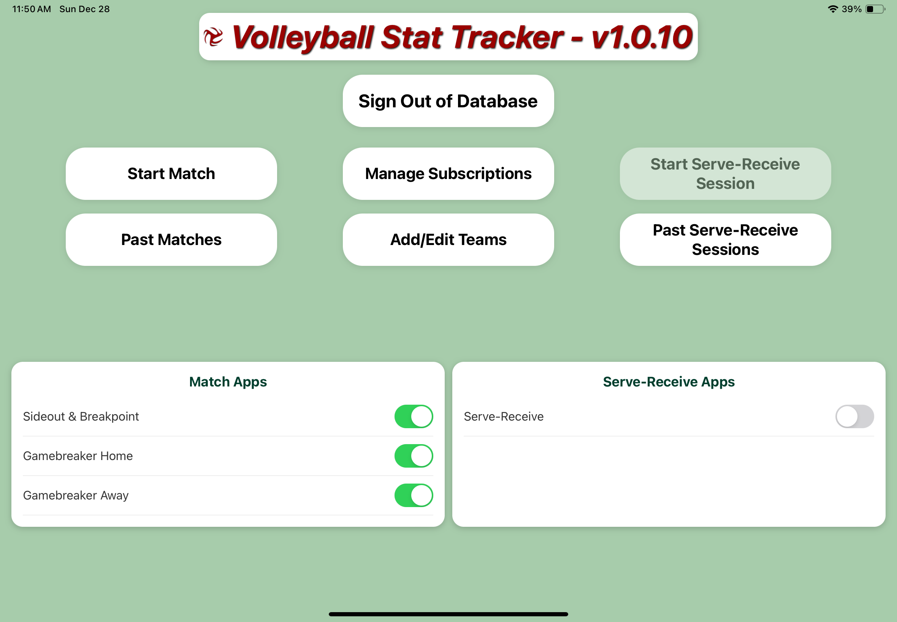</strong>
                

            </td>
            <td style="width: 50%; padding: 0cm 5.4pt; vertical-align: top; border: none;">
                

                    <strong>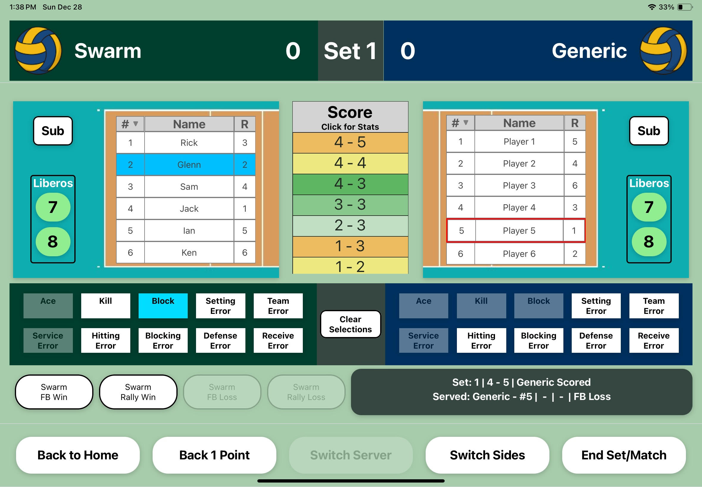</strong>
                

            </td>
        </tr>
        <tr>
            <td style="width: 50%; padding: 0cm 5.4pt; vertical-align: top; border: none;">
                

                    <strong>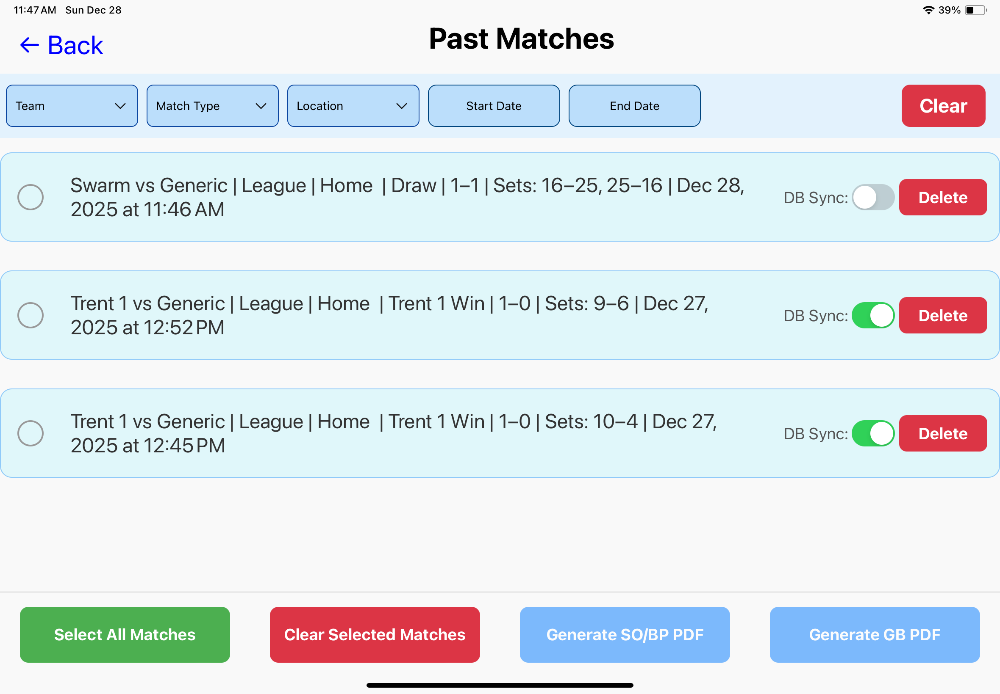</strong>
                

            </td>
            <td style="width: 50%; padding: 0cm 5.4pt; vertical-align: top; border: none;">
                

                    <strong>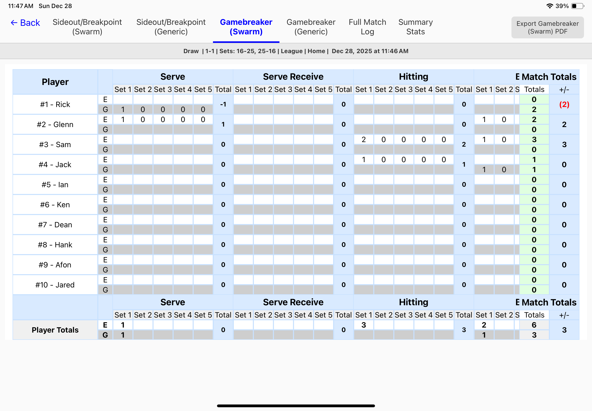</strong>
                

            </td>
        </tr>
    </tbody>
</table>

<strong>&nbsp;</strong>

<strong>Stop Guessing! Start Tracking!</strong> &nbsp; &nbsp;Unlock your team&apos;s full potential with the ultimate volleyball stat tracker. Our app provides data-driven insights to make informed decisions and develop your athletes&apos; skills. Track live stats during matches and practices, capturing detailed performance metrics with just a tap. Analyze player development, identify growth opportunities, and create targeted practice plans based on real data.

<strong>Key Features: &nbsp;</strong>

<strong>Comprehensive Data Collection</strong>

<ul style="list-style-type: disc;margin-left: 25.85px;">
    <li>Live Stat Taking: Record match and practice stats in real time. Track first ball wins/losses, rally outcomes, service aces/errors, kills, blocks, and various errors.</li>
    <li>Performance Metrics: Monitor scoring streaks and side out/breakpoint statistics for players and team.</li>
    <li>Roster Management: Add/edit/remove players from your teams and opponent teams. &nbsp;</li>
</ul>

<strong>Versatile Application Suite</strong>

<ul style="list-style-type: disc;margin-left: 25.85px;">
    <li>Multiple Apps in One Account: Three integrated apps&mdash;side out/breakpoint, gamebreaker, and serve-receive&mdash;usable together on one device or across two.</li>
    <li>User-Friendly Interface: Quick stat entry on tablet or phone, by one or two stat takers, capturing every meaningful play. &nbsp;</li>
</ul>

<strong>Data-Driven Development Tools</strong>

<ul style="list-style-type: disc;margin-left: 26.15px;">
    <li>&nbsp;Session &amp; Game Summaries: Review performance with detailed reports highlighting strengths and development areas.</li>
    <li>Comprehensive Season Data: Track progress with cumulative summaries. Filter by date, team, location, or match type.</li>
    <li>Easy Data Export: Share insights through comprehensive PDFs. &nbsp;</li>
</ul>

<strong>Educational Benefits</strong>

<ul style="list-style-type: disc;margin-left: 26.15px;">
    <li>Targeted Practice Planning: Identify skill areas needing attention for focused sessions.</li>
    <li>Player Development Tracking: Help athletes visualize progress and set goals.</li>
    <li>Team Dynamics Analysis: Optimize rotations based on player combinations.</li>
    <li>Evidence-Based Coaching: Replace subjective impressions with concrete data. &nbsp;</li>
</ul>

<strong>Three Powerful Apps:</strong>

<strong>Game Breaker - Track Point Production and Game Flow</strong>

 &nbsp;Reveals who&apos;s contributing to success and where improvements are needed:

<ul style="list-style-type: disc;">
    <li>Identify point scorers and point givers</li>
    <li>Track scoring runs for informed timeout decisions</li>
    <li>Analyze impactful servers on both teams</li>
    <li>Pinpoint strongest/weakest rotations</li>
    <li>Motivate athletes with transparent performance data</li>
    <li>Make data-driven substitutions</li>
</ul>

&nbsp;

<strong>Sideout/BreakPoint - Master the Serve and First Ball Battle</strong>

 &nbsp;Digs deeper into the crucial first phase of every rally:

&nbsp;

<ul style="list-style-type: disc;">
    <li>Discover which servers create the most breakpoint opportunities</li>
    <li>Identify troublesome opponent servers</li>
    <li>Analyze rotation-specific sideout performance</li>
    <li>Access comprehensive first-ball data</li>
    <li>Focus practice on specific rotations</li>
    <li>Develop strategic serves for breakpoint opportunities</li>
    <li>Track sideout percentage improvements &nbsp;</li>
</ul>

<strong>Serve vs Serve Receive - Elevate Practice Intensity with Purpose</strong>

 &nbsp;Transform routine drills into competitive challenges:

&nbsp;

<ul style="list-style-type: disc;">
    <li>Create competitions between servers and passers</li>
    <li>Raise stakes with data-driven challenges</li>
    <li>Determine objectively who the best passers are</li>
    <li>Identify problematic serve types</li>
    <li>Bring purpose to serve and pass drills</li>
    <li>Track improvement with detailed metrics</li>
    <li>Customize drills based on match weaknesses &nbsp;</li>
</ul>

<strong><em>Move beyond the clipboard into the future of volleyball analytics. Get the data you need to elevate team development and help every athlete reach their potential. &nbsp; &nbsp;Our focus isn&apos;t just winning&mdash;it&apos;s creating a culture of continuous improvement through meaningful data and actionable insights.</em></strong>

 

<table style="width: 100%; border-collapse: collapse; border: none;">
    <tbody>
        <tr>
            <td style="width: 50%; padding: 0cm 5.4pt; vertical-align: top; border: none;">
                

                    <strong>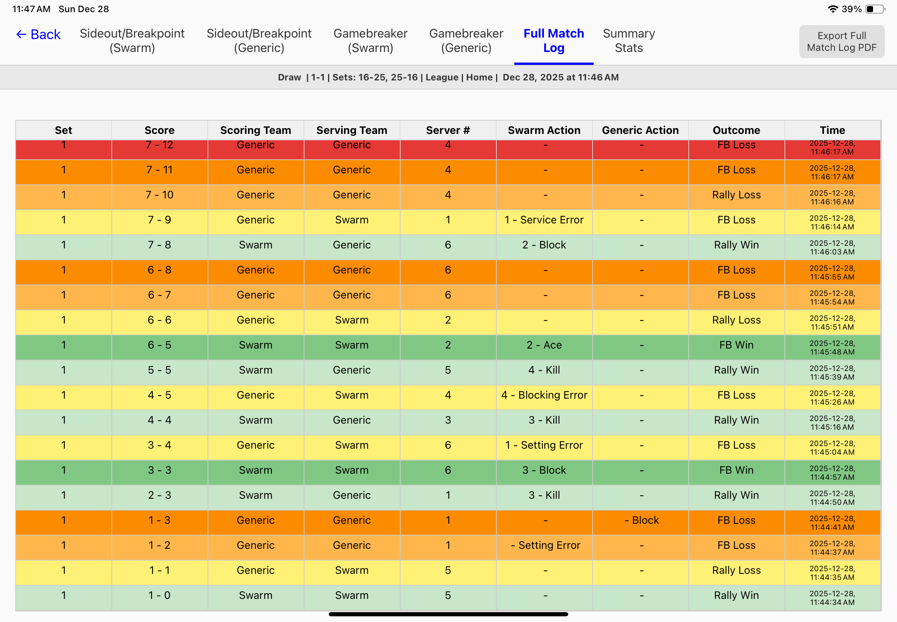</strong>
                

            </td>
            <td style="width: 50%; padding: 0cm 5.4pt; vertical-align: top; border: none;">
                

                    <strong>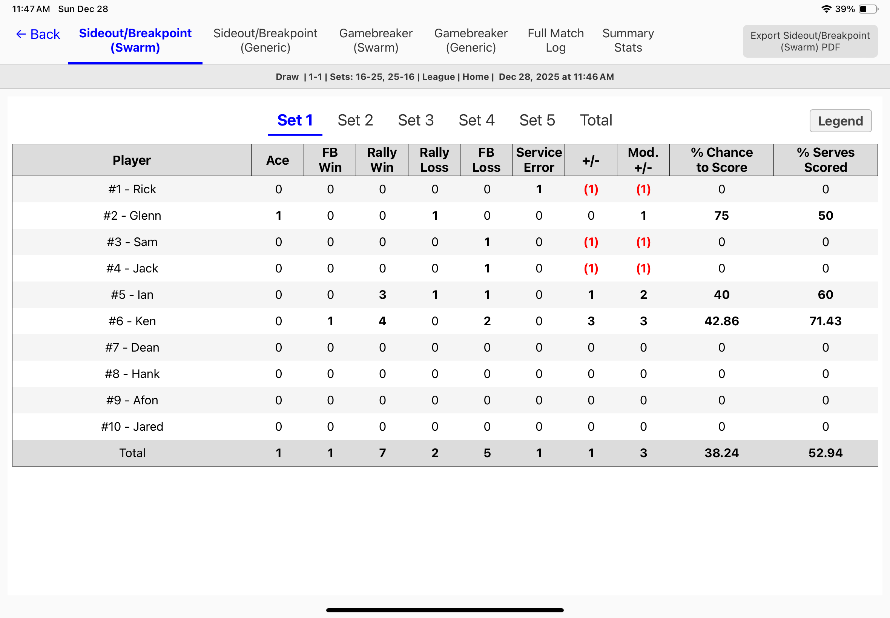</strong>
                

            </td>
        </tr>
        <tr>
            <td style="width: 50%; padding: 0cm 5.4pt; vertical-align: top; border: none;">
                

                    <strong>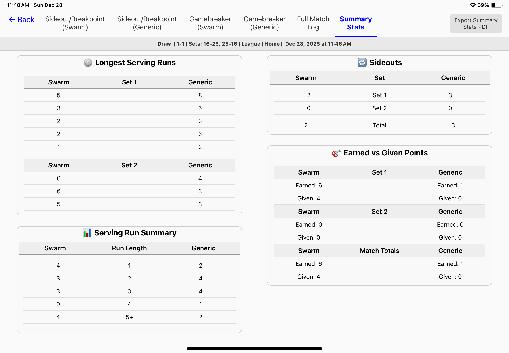</strong>
                

            </td>
            <td style="width: 50%; padding: 0cm 5.4pt; vertical-align: top; border: none;">
                

                    <strong>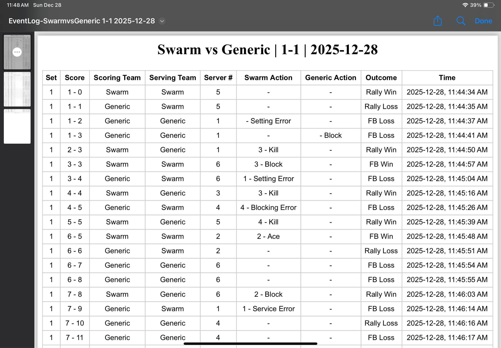</strong>
                

            </td>
        </tr>
         <tr>
            <td style="width: 50%; padding: 0cm 5.4pt; vertical-align: top; border: none;">
                

                    <strong>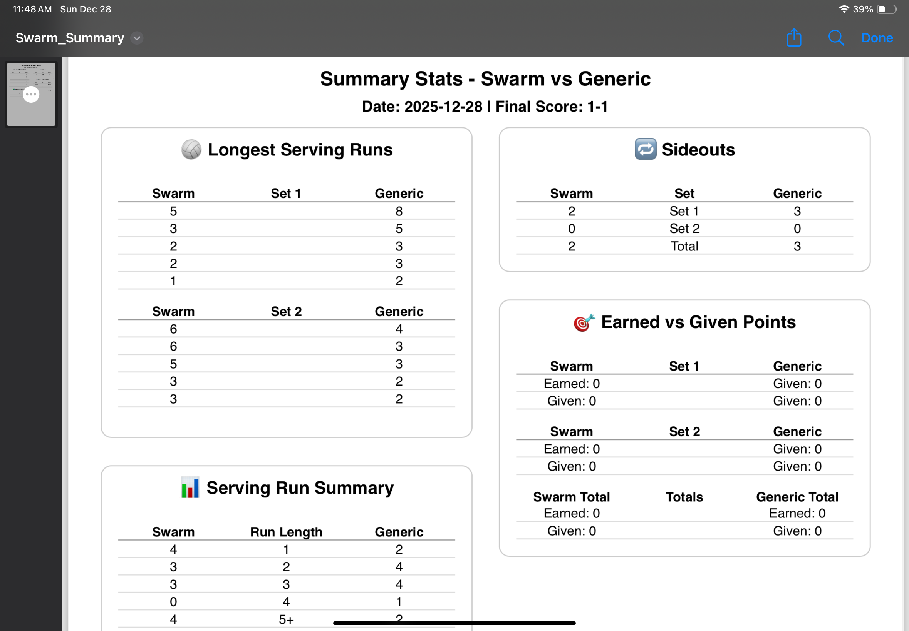</strong>
                

            </td>
            <td style="width: 50%; padding: 0cm 5.4pt; vertical-align: top; border: none;">
                

                    <strong>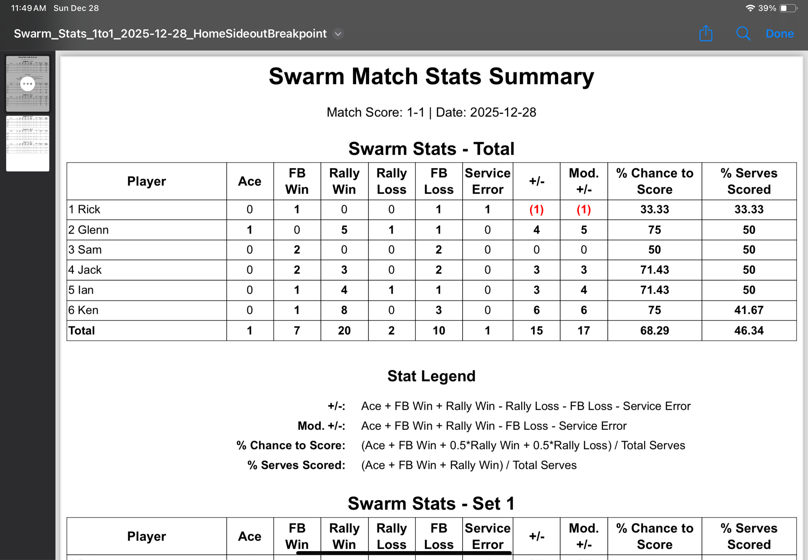</strong>
                

            </td>
        </tr>
         <tr>
            <td style="width: 50%; padding: 0cm 5.4pt; vertical-align: top; border: none;">
                

                    <strong>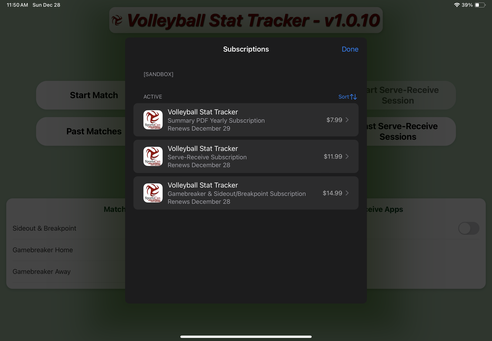</strong>
                

            </td>
            <td style="width: 50%; padding: 0cm 5.4pt; vertical-align: top; border: none;">
                

                    <strong></strong>
                

            </td>
        </tr>
         <tr>
            <td style="width: 50%; padding: 0cm 5.4pt; vertical-align: top; border: none;">
                

                    <strong>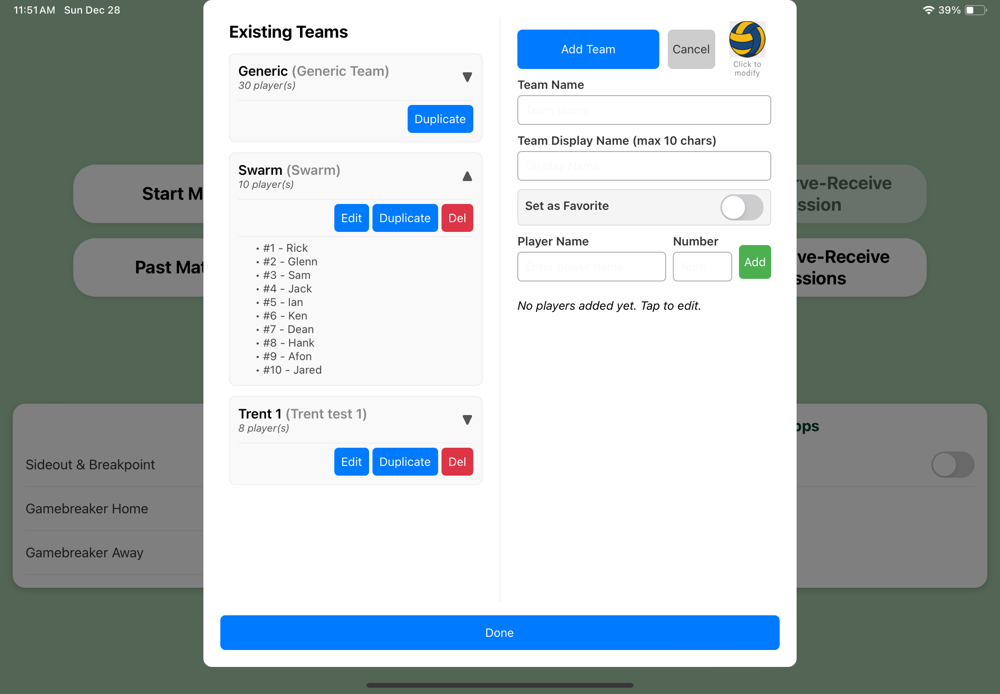</strong>
                

            </td>
            <td style="width: 50%; padding: 0cm 5.4pt; vertical-align: top; border: none;">
                

                    <strong>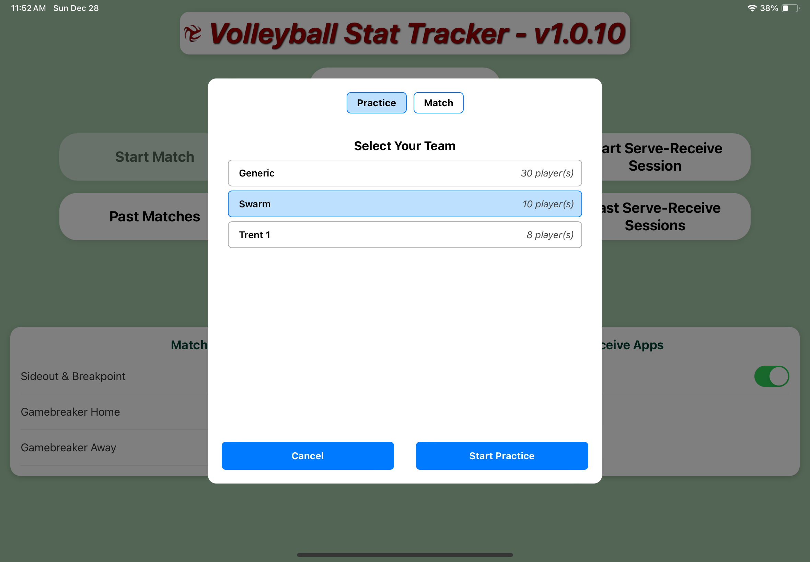</strong>
                

            </td>
        </tr>
         <tr>
            <td style="width: 50%; padding: 0cm 5.4pt; vertical-align: top; border: none;">
                

                    <strong>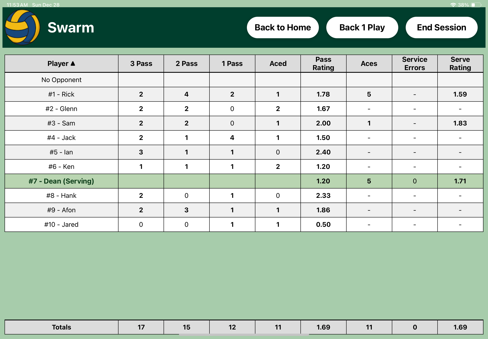</strong>
                

            </td>
            <td style="width: 50%; padding: 0cm 5.4pt; vertical-align: top; border: none;">
                

                    <strong>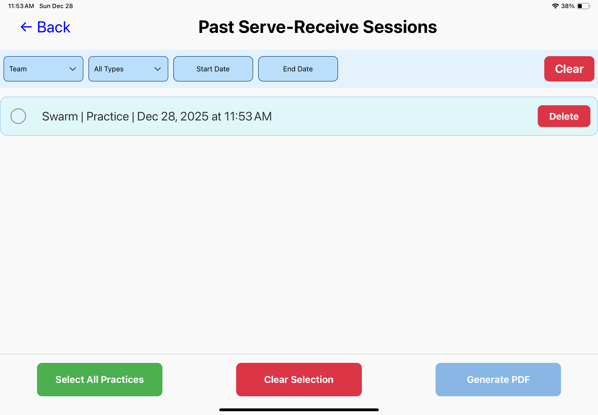</strong>
                

            </td>
        </tr>
         <tr>
            <td style="width: 50%; padding: 0cm 5.4pt; vertical-align: top; border: none;">
                

                    <strong>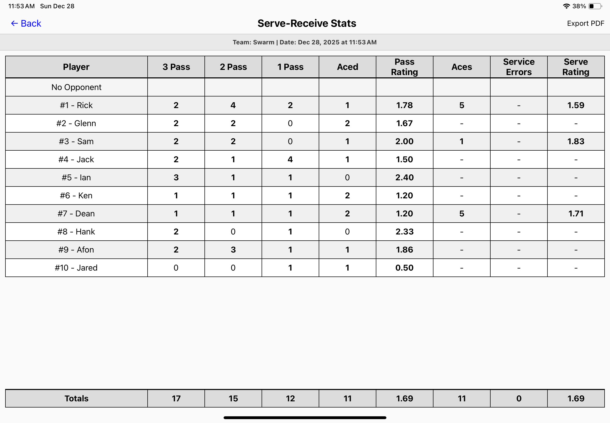</strong>
                

            </td>
            <td style="width: 50%; padding: 0cm 5.4pt; vertical-align: top; border: none;">
                

                    <strong>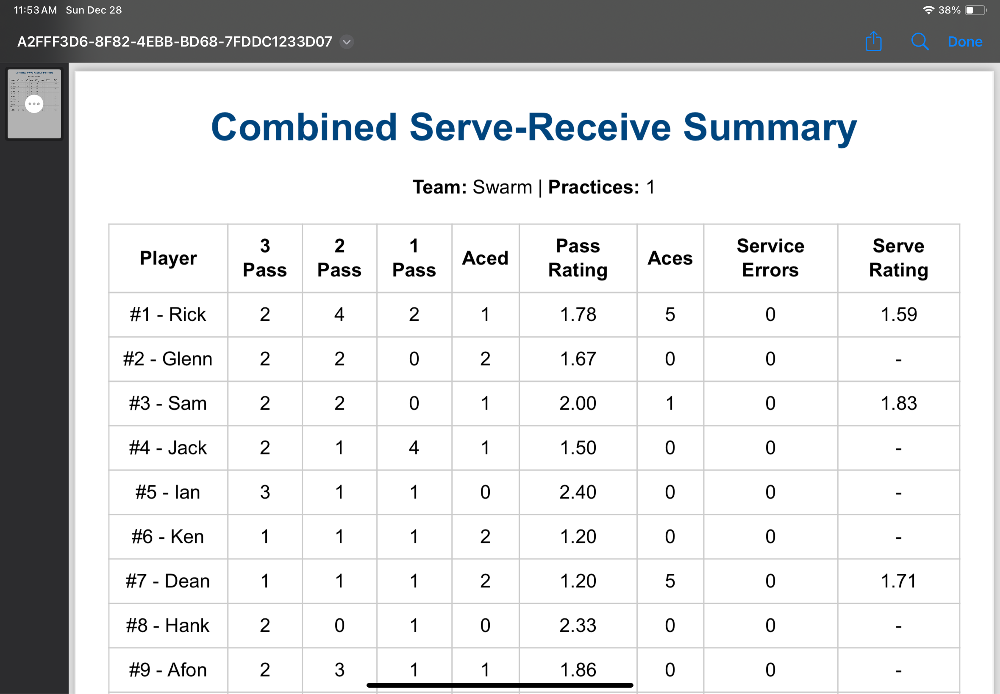</strong>
                

            </td>
        </tr>
    </tbody>
</table>
